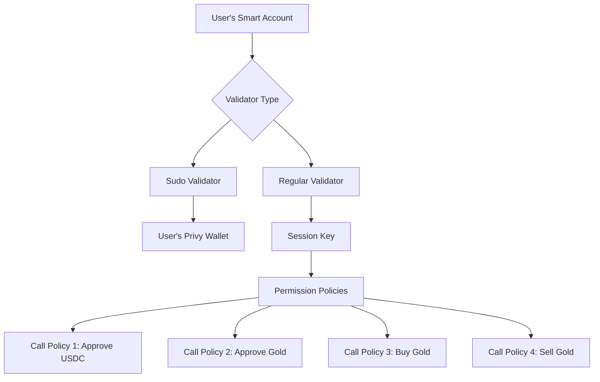

# Session Key Security Model

## 🔒 Overview

This document explains how session keys protect user funds in the Aureo AI Trading system while enabling automated trading capabilities.

---

## 🎯 Core Security Principles

### 1. **Least Privilege Principle**

Session keys follow the principle of least privilege - they have **only** the minimum permissions needed to execute trades:

```
✅ CAN DO:
- Approve USDC to AureoRWAPool
- Approve mGOLD to AureoRWAPool  
- Call buyGold() on AureoRWAPool
- Call sellGold() on AureoRWAPool

❌ CANNOT DO:
- Transfer tokens directly to any address
- Approve tokens to addresses other than AureoRWAPool
- Interact with any other smart contracts
- Change account ownership
- Modify account permissions
- Execute delegate calls
- Self-destruct the account
```

### 2. **Scoped Permissions**

The session key uses **ZeroDev's Permission Validator** with explicit policies that restrict:

- **Target Contracts**: Only MockUSDC, MockGold, and AureoRWAPool
- **Function Calls**: Only `approve()`, `buyGold()`, `sellGold()`
- **Arguments**: Approve can only target AureoRWAPool as spender

---

## 🛡 How Session Keys Protect User Funds

### Scenario 1: Direct Token Transfer

**Attack Attempt:**
```javascript
// Attacker tries to transfer user's USDC to their own address
agent.transferUSDC(attackerAddress, userBalance);
```

**Protection:**
```
❌ BLOCKED - Session key does NOT have permission to call transfer()
```

The session key policy explicitly **does not** grant permission for `transfer()` or `transferFrom()` functions.

---

### Scenario 2: Approving to Malicious Contract

**Attack Attempt:**
```javascript
// Attacker tries to approve a malicious contract to spend user's tokens
agent.approve(maliciousContract, maxUint256);
```

**Protection:**
```
❌ BLOCKED - Session key can ONLY approve AureoRWAPool
```

The `toCallPolicy` has an argument constraint that enforces:
```typescript
args: [
  {
    operator: 'EQUAL',
    value: AUREO_POOL_ADDRESS  // Must equal this address
  },
  null  // Amount can be any value
]
```

---

### Scenario 3: Interacting with Other Contracts

**Attack Attempt:**
```javascript
// Attacker tries to interact with a different DeFi protocol
agent.swapOnUniswap(token1, token2, amount);
```

**Protection:**
```
❌ BLOCKED - Session key can ONLY interact with:
  - MockUSDC (for approve)
  - MockGold (for approve)
  - AureoRWAPool (for buyGold/sellGold)
```

The `toCallPolicy` explicitly restricts the **target** addresses.

---

### Scenario 4: Changing Account Ownership

**Attack Attempt:**
```javascript
// Attacker tries to change the smart account owner
agent.transferOwnership(attackerAddress);
```

**Protection:**
```
❌ BLOCKED - Session key is NOT the sudo validator
```

Only the original **sudo validator** (user's Privy embedded wallet) can modify account settings. The session key is a **regular validator** with limited permissions.

---

## 🔍 Technical Deep Dive

### Permission Validator Architecture



**Key Points:**

1. **Sudo Validator** (User's wallet):
   - Full control over the account
   - Can modify validators
   - Can execute any transaction

2. **Regular Validator** (Session key):
   - Restricted by permission policies
   - Cannot modify account settings
   - Can only call whitelisted functions

### Policy Structure

Each policy in the session key validator has this structure:

```typescript
toCallPolicy({
  permissions: [
    {
      target: CONTRACT_ADDRESS,      // Which contract
      abi: CONTRACT_ABI,              // ABI for function signature
      functionName: 'functionName',   // Which function
      args: [                         // Argument constraints
        {
          operator: 'EQUAL',          // Comparison operator
          value: REQUIRED_VALUE        // Required value
        },
        null                           // No constraint
      ]
    }
  ]
})
```

**Example - Approve USDC Policy:**
```typescript
{
  target: 0x53b8e9e6513A2e7A4d23F8F9BFe3F5985C9788e4,  // MockUSDC
  abi: ERC20_ABI,
  functionName: 'approve',
  args: [
    {
      operator: 'EQUAL',
      value: 0x475F5c184D23D5839123e7CDB23273eF0470C018  // AureoRWAPool
    },
    null  // Amount can be anything
  ]
}
```

---

## ⏰ Time-Based Security

### Session Key Expiration

Session keys have a built-in expiration mechanism:

```typescript
const expiresAt = Math.floor(Date.now() / 1000) + durationInSeconds;
```

**Default Duration:** 7 days

**What happens after expiration:**
- Session key becomes invalid
- AI Agent cannot execute any transactions
- User must create a new session key to re-enable AI trading

**Benefits:**
- Limits the window of potential misuse
- Encourages regular re-authorization
- Allows users to revoke access by simply waiting for expiration

---

## 🚨 Attack Vector Analysis

### 1. Session Key Theft

**Risk:** If the session key private key is stolen

**Impact:** 
- Attacker can execute trades (buy/sell gold) on user's behalf
- Attacker **CANNOT** transfer tokens out of the account
- Attacker **CANNOT** approve tokens to other addresses

**Mitigation:**
- Session keys stored securely on backend
- Short expiration window (7 days)
- Limited permissions prevent fund theft
- User can monitor trades and revoke access

---

### 2. Backend Compromise

**Risk:** If the backend server is compromised

**Impact:**
- Attacker gains access to session keys
- Same as "Session Key Theft" scenario

**Mitigation:**
- Session keys have scoped permissions
- Cannot transfer funds directly
- User maintains ultimate control via sudo validator
- Can deploy backend with additional security (encrypted storage, HSM, etc.)

---

### 3. Frontrunning/MEV

**Risk:** Attacker monitors mempool and frontruns trades

**Impact:**
- Attacker could manipulate prices before user's trade executes
- Potentially unfavorable swap rates

**Mitigation:**
- Use private mempools or Flashbots-like solutions
- Implement slippage protection in smart contracts
- Monitor for suspicious price movements

---

### 4. Smart Contract Vulnerability

**Risk:** AureoRWAPool contract has a vulnerability

**Impact:**
- Session key can only interact with AureoRWAPool
- If pool is exploited, user funds at risk

**Mitigation:**
- Audit AureoRWAPool contract thoroughly
- Implement emergency pause mechanisms
- Use upgradeable proxy patterns with timelock
- User can revoke session key if vulnerability discovered

---

## 🛠 User Control Mechanisms

### 1. Revocation

Users can revoke session key access at any time:

```typescript
// User signs with their sudo validator to remove session key
await kernelClient.removeValidator(sessionKeyValidator);
```

### 2. Monitoring

Users can monitor all transactions:
- View transaction history in block explorer
- Set up alerts for unexpected trades
- Query backend API for session key usage stats

### 3. Re-authorization

After expiration, users must explicitly re-authorize:
- Prevents indefinite access
- Allows users to review terms
- Opportunity to adjust permissions if needed

---

## 📊 Security Comparison

| Scenario | Traditional Bot | Session Key Approach |
|----------|----------------|---------------------|
| Fund Custody | Bot controls private key | User controls account |
| Token Transfer | Bot can transfer | Session key **cannot** |
| Modify Permissions | Bot can do anything | Session key has **limited scope** |
| Revocation | Must trust bot provider | User can revoke **anytime** |
| Expiration | No built-in limit | Expires after 7 days |
| Transparency | Opaque | All transactions on-chain |

---

## ✅ Best Practices

### For Users

1. **Review Permissions:** Understand what the session key can do before signing
2. **Monitor Trades:** Regularly check your transaction history
3. **Set Alerts:** Use blockchain monitoring tools to get notified of trades
4. **Revoke When Done:** If you're not actively using AI trading, revoke the session key
5. **Use Test Accounts First:** Try on Mantle Sepolia before using real funds

### For Developers

1. **Minimal Permissions:** Only grant permissions absolutely necessary
2. **Short Expiration:** Default to shorter durations (7 days or less)
3. **Audit Policies:** Review permission policies thoroughly
4. **Secure Storage:** Store session keys securely (encrypted, HSM, etc.)
5. **Monitoring:** Implement logging and alerting for session key usage
6. **Emergency Stop:** Build in mechanisms to disable AI trading immediately

---

## 🔗 References

- [ZeroDev Permissions Documentation](https://docs.zerodev.app/sdk/permissions/intro)
- [ERC-4337 Account Abstraction](https://eips.ethereum.org/EIPS/eip-4337)
- [Kernel Smart Account](https://docs.zerodev.app/sdk/core-api/create-account)

---

**Remember:** Session keys enable powerful automation while maintaining security through:
1. **Scoped Permissions** - Can only call specific functions
2. **Argument Constraints** - Cannot approve to wrong addresses
3. **Time Limits** - Automatic expiration
4. **User Control** - Can revoke anytime via sudo validator

This defense-in-depth approach ensures that even if a session key is compromised, user funds remain safe.
