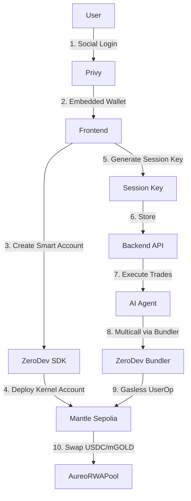

# ZeroDev Smart Account Integration for Aureo RWA Protocol

## 🎯 Overview

This implementation integrates **ZeroDev Kernel v3 Smart Accounts** with session keys for the Aureo RWA Gold Protocol, enabling AI-driven automated trading while maintaining full user control and security.

### Key Features

- **Isolated Smart Wallets**: Each user gets their own Kernel Smart Account (vault)
- **Session Keys**: Scoped permissions allow AI Agent to trade without requiring signatures for each transaction
- **Gasless Transactions**: All operations sponsored by ZeroDev Paymaster
- **Atomic Multicalls**: Approve + Trade executed in a single transaction
- **Non-Custodial**: Users maintain full control; AI Agent cannot transfer funds directly

---

## 🏗 Architecture



### Flow Diagram

**User Onboarding:**
1. User logs in with Privy (Google/Twitter/Email)
2. Privy creates an embedded wallet for the user
3. Frontend uses embedded wallet to create a Kernel Smart Account
4. User clicks "Enable AI Trading"
5. Frontend generates a session key with scoped permissions
6. User signs to authorize the session key
7. Session key is sent to backend for storage

**AI Agent Execution:**
1. AI Agent loads session key from backend
2. Agent initializes Kernel Client using session key
3. Agent monitors market conditions (oracle price, balances)
4. When conditions are met, Agent creates a multicall:
   - `approve(AureoRWAPool, amount)` on token contract
   - `buyGold(amount)` or `sellGold(amount)` on pool
5. Agent sends UserOperation via ZeroDev Bundler
6. Paymaster sponsors the transaction (gasless)
7. Transaction is executed atomically on-chain

---

## 📁 Project Structure

```
Aureo/SC/
├── frontend/                   # Next.js Frontend
│   ├── app/
│   │   ├── layout.tsx         # Privy provider setup
│   │   ├── page.tsx           # Main UI
│   │   └── globals.css        # Tailwind styles
│   ├── components/
│   │   ├── WalletConnect.tsx  # Social login + Smart Account creation
│   │   └── EnableAITrading.tsx # Session key generation
│   ├── lib/
│   │   └── ZeroDevSetup.ts    # Core ZeroDev logic
│   ├── config/
│   │   └── constants.ts       # Network config, ABIs, addresses
│   ├── package.json
│   ├── tsconfig.json
│   └── .env.example
│
├── backend/                    # Node.js Backend
│   ├── src/
│   │   ├── index.ts           # Express API for session key storage
│   │   └── AIAgentExecutor.ts # AI Agent trading logic
│   ├── package.json
│   ├── tsconfig.json
│   └── .env.example
│
├── ZERODEV_INTEGRATION.md     # This file
└── SESSION_KEY_SECURITY.md    # Security documentation
```

---

## 🚀 Setup Instructions

### Prerequisites

1. **Node.js** >= 18.x
2. **npm** or **yarn**
3. **Privy App ID** - Get one at [privy.io](https://privy.io)
4. **ZeroDev Project ID** - Get one at [zerodev.app](https://zerodev.app)

### Step 1: Frontend Setup

```bash
cd frontend

# Install dependencies
npm install

# Copy environment template
cp .env.example .env.local

# Edit .env.local and add your API keys:
# - NEXT_PUBLIC_PRIVY_APP_ID
# - NEXT_PUBLIC_ZERODEV_PROJECT_ID
# - NEXT_PUBLIC_ZERODEV_BUNDLER_RPC
# - NEXT_PUBLIC_ZERODEV_PAYMASTER_RPC
```

### Step 2: Backend Setup

```bash
cd ../backend

# Install dependencies
npm install

# Copy environment template
cp .env.example .env

# Edit .env and add your API keys:
# - ZERODEV_PROJECT_ID
# - ZERODEV_BUNDLER_RPC
# - ZERODEV_PAYMASTER_RPC
```

### Step 3: Run the Application

**Terminal 1 - Backend:**
```bash
cd backend
npm run dev
```

**Terminal 2 - Frontend:**
```bash
cd frontend
npm run dev
```

Open [http://localhost:3000](http://localhost:3000) in your browser.

---

## 📖 Usage Guide

### For Users

1. **Connect Wallet**
   - Click "Login with Privy"
   - Choose Google, Twitter, or Email
   - Your Smart Account will be created automatically

2. **Enable AI Trading**
   - Click "Enable AI Trading"
   - Sign the transaction to authorize the session key
   - AI Agent can now trade on your behalf for 7 days

3. **Monitor Your Trades**
   - View your USDC and mGOLD balances in real-time
   - All transactions are gasless (no MNT required)

### For Developers

#### Running the AI Agent

```bash
cd backend

# Set your session key and smart account address in .env
# SESSION_KEY_EXAMPLE=0x...
# SMART_ACCOUNT_ADDRESS=0x...

# Run the AI Agent
npm run agent
```

#### Customizing Trading Logic

Edit `backend/src/AIAgentExecutor.ts` and modify the `monitorAndTrade()` function:

```typescript
async monitorAndTrade() {
  const price = await this.getGoldPrice();
  const balances = await this.getBalances();

  // Your custom logic here
  if (price < parseUnits('2000', 18) && balances.usdc > parseUnits('100', 6)) {
    await this.executeBuyGold(parseUnits('100', 6));
  }
}
```

---

## 🔐 Security Model

### Session Key Permissions

The session key has **ONLY** the following permissions:

✅ **Allowed:**
- `approve(address spender, uint256 amount)` on MockUSDC (only if spender = AureoRWAPool)
- `approve(address spender, uint256 amount)` on MockGold (only if spender = AureoRWAPool)
- `buyGold(uint256 usdcAmount)` on AureoRWAPool
- `sellGold(uint256 goldAmount)` on AureoRWAPool

❌ **NOT Allowed:**
- Direct token transfers (`transfer`, `transferFrom`)
- Interactions with any other contracts
- Approving tokens to any address other than AureoRWAPool
- Any other function calls

See [SESSION_KEY_SECURITY.md](./SESSION_KEY_SECURITY.md) for detailed security analysis.

---

## 🧪 Testing

### Manual Testing Flow

1. **Create Smart Account:**
   - Login with Privy
   - Verify smart account is created
   - Check balances are displayed

2. **Enable Session Key:**
   - Click "Enable AI Trading"
   - Sign the transaction
   - Verify session key is stored on backend

3. **Execute Trade:**
   - Fund your smart account with Mock USDC (use faucet)
   - Run the AI Agent script
   - Verify trade executes successfully
   - Check updated balances

4. **Test Security:**
   - Try to call unauthorized function with session key → Should fail
   - Try to transfer tokens directly → Should fail
   - Try to approve tokens to wrong address → Should fail

---

## 🌐 Deployed Contracts

All contracts are deployed on **Mantle Sepolia Testnet**.

| Contract | Address | Explorer |
|----------|---------|----------|
| AureoRWAPool | `0x475F5c184D23D5839123e7CDB23273eF0470C018` | [View](https://explorer.sepolia.mantle.xyz/address/0x475F5c184D23D5839123e7CDB23273eF0470C018) |
| MockUSDC | `0x53b8e9e6513A2e7A4d23F8F9BFe3F5985C9788e4` | [View](https://explorer.sepolia.mantle.xyz/address/0x53b8e9e6513A2e7A4d23F8F9BFe3F5985C9788e4) |
| MockGold | `0x6830999D9173B235dF6ac8c9068c4235fd58f532` | [View](https://explorer.sepolia.mantle.xyz/address/0x6830999D9173B235dF6ac8c9068c4235fd58f532) |

---

## 🐛 Troubleshooting

### Issue: "Session key creation failed"

**Solution:**
- Ensure you have Privy App ID and ZeroDev Project ID configured
- Check that you're connected to Mantle Sepolia
- Verify ZeroDev Bundler and Paymaster URLs are correct

### Issue: "Transaction failed"

**Solution:**
- Ensure your smart account has enough USDC/mGOLD balance
- Check that the session key hasn't expired
- Verify Paymaster is properly configured for gas sponsorship

### Issue: "Permission denied"

**Solution:**
- Session keys can only call specific functions
- Ensure you're only calling `approve`, `buyGold`, or `sellGold`
- Check that you're approving to the correct address (AureoRWAPool)

---

## 📚 Additional Resources

- [ZeroDev Documentation](https://docs.zerodev.app/)
- [Privy Documentation](https://docs.privy.io/)
- [Mantle Network Documentation](https://docs.mantle.xyz/)
- [Viem Documentation](https://viem.sh/)

---

## 💡 Next Steps

1. **Get API Keys:**
   - Create a Privy account and set up your app
   - Create a ZeroDev project and get your Project ID

2. **Fund Test Accounts:**
   - Get Mantle Sepolia MNT from faucet (for deployments)
   - Mint Mock USDC using the contract's faucet function

3. **Deploy and Test:**
   - Follow the setup instructions above
   - Test the full flow end-to-end

4. **Customize AI Logic:**
   - Implement your trading strategy in `AIAgentExecutor.ts`
   - Add market analysis, risk management, etc.

---

**Built with ❤️ for the Aureo RWA Protocol**
